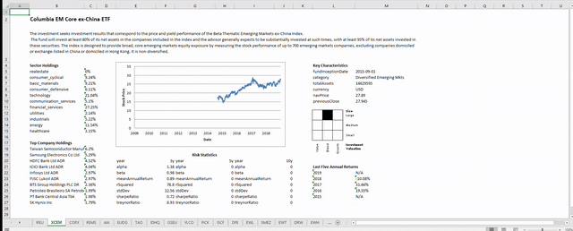

# The Passive Investor

Theories and research about the stock market have stated that the semi-strong form of market efficiency seems to hold. This means that all public information is accurately reflected in the price of an financial instrument. This makes the job of a portfolio manager primarily managing the desired risk appetite of the client and not explicitly trying to outperform the market. This fact in combination with Finance professionals all around the world looking for that 'edge' to make their investment decisions as profitable as possible, makes it so the average joe can not compete.

Therefore, the term 'Passive Investing' is often coined around. This often refers to buying ETFs that follow the index (i.e. S&P 500, Dow Jones Index) or a broad market (Developed Markets, MSCI World) for diversification benefits. This means that a sudden decrease in performance of one stock within the index does not (on average) lead to a significant decline in the index as a whole. This also allows the holder to spend limited time monitoring his holdings, therefore the term 'Passive'.

With a large increase in ETFs available (over 5,000 in 2020), it can become difficult to make the right choice in what ETFs you wish to invest. There are many different providers offering ETFs (iShares, Vanguard, Invesco) as well as with changes to the underlying stocks (i.e. High Yield, Super Dividends, Equal Weighted). This is quickly reflected when looking for a S&P 500 ETF as there are over 20 different ETFs available.

With this program and the accompanying spreadsheet, I wish to make investment decisions easier to make and manage.

## Functionality
The program is able to output an overview of each ETF (or Mutual Fund) on a seperate sheet. In this overview the following data is shown:
- The title of the fund
- A summary about the fund's purpose/goal
- Sector Holdings (% in each sector)
- Company Holdings (top 10 companies with highest %)
- Risk Statistics (several measures of risk)
- Characteristics of the instrument (inception date, category, total assets, currency, NAV price and latest close price)
- Morningstar Style Box (style of the fund)
- Last five annual returns
- Graph depicting the adjusted close prices over the last 10 years

An example of the output can be found in the GIF below. This depicts several ETFs found automatically collected from [the Top ETFs according to Yahoo Finance](https://finance.yahoo.com/etfs){:target="_blank"}.
 

<i>Example of several ETFs from Yahoo Finance</i>

## Example
